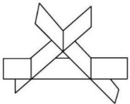

# 2019 年全国硕士研究生招生考试数学一真题

## 一、选择题

<!-- source: 【横版】10-26年数一真题套卷做题本.pdf; PDF 第 208 页 -->

### 第 1 题

当  $x \to 0$ 时，若  $x - \tan x$ 与  $x^k$ 是同阶无穷小，则  $k = (\quad)$

A. 1.

B. 2.

C. 3.

D. 4.

<!-- source: 【横版】10-26年数一真题套卷做题本.pdf; PDF 第 209 页 -->

### 第 2 题

设函数  $f(x)=\begin{cases}x|x|,&x\leq0,\\x\ln x,&x>0,\end{cases}$ 则 x=0 是  $f(x)$ 的 ()

A. 可导点,极值点.

B. 不可导点,极值点.

C. 可导点,非极值点.

D. 不可导点,非极值点.

<!-- source: 【横版】10-26年数一真题套卷做题本.pdf; PDF 第 210 页 -->

### 第 3 题

设  $\{u_{n}\}$ 是单调增加的有界数列，则下列级数中收敛的是（）

A. $\sum_{n=1}^{\infty}\frac{u_{n}}{n}$.

B. $\sum_{n=1}^{\infty}(-1)^{n}\frac{1}{u_{n}}$.

C. $\sum_{n=1}^{\infty}\left(1-\frac{u_{n}}{u_{n+1}}\right)$.

D. $\sum_{n=1}^{\infty}\left(u_{n+1}^{2}-u_{n}^{2}\right)$.

<!-- source: 【横版】10-26年数一真题套卷做题本.pdf; PDF 第 211 页 -->

### 第 4 题

设函数  $Q(x,y)=\frac{x}{y^2}$. 如果对上半平面  $(y>0)$ 内的任意有向光滑封闭曲线 C 都有  $\oint_C P(x,y)\mathrm{d}x + Q(x,y)\mathrm{d}y = 0$，那么函数  $P(x,y)$ 可取为 ( )

A. $y - \frac{x^2}{y^3}$.

B. $\frac{1}{y} - \frac{x^2}{y^3}$.

C. $\frac{1}{x} - \frac{1}{y}$.

D. $x - \frac{1}{y}$.

<!-- source: 【横版】10-26年数一真题套卷做题本.pdf; PDF 第 212 页 -->

### 第 5 题

A 是 3 阶实对称矩阵，E 是 3 阶单位矩阵。若  $A^{2} + A = 2E$，且  $|A| = 4$，则二次型  $x^{T}Ax$ 的规范形为 ( )

A. $y_{1}^{2}+y_{2}^{2}+y_{3}^{2}$

B. $y_{1}^{2}+y_{2}^{2}-y_{3}^{2}$

C. $y_{1}^{2}-y_{2}^{2}-y_{3}^{2}$

D. $-y_{1}^{2}-y_{2}^{2}-y_{3}^{2}$

<!-- source: 【横版】10-26年数一真题套卷做题本.pdf; PDF 第 213 页 -->

### 第 6 题

如图所示，有3张平面两两相交，交线相互平行，它们的方程  $a_{i1}x + a_{i2}y + a_{i3}z = d_{i}$ (i=1,2,3) 组成的线性方程组的系数矩阵和增广矩阵分别记为  $A, \overline{A}$，则（）

A. $r(A)=2, r(\overline{A})=3.$

B. $r(A)=2, r(\overline{A})=2.$

C. $r(A)=1, r(\overline{A})=2.$

D. $r(A)=1, r(\overline{A})=1.$

<!-- source: 【横版】10-26年数一真题套卷做题本.pdf; PDF 第 214 页 -->

### 第 7 题

设 A, B 为随机事件, 则  $P(A) = P(B)$ 的充分必要条件是 ( )

A. $P(A \cup B) = P(A) + P(B).$

B. $P(AB) = P(A)P(B).$

C. $P(AB) = P(B\overline{A})$.

D. $P(AB) = P(\overline{A}\overline{B})$.

<!-- source: 【横版】10-26年数一真题套卷做题本.pdf; PDF 第 215 页 -->

### 第 8 题

设随机变量 X 与 Y 相互独立，且都服从正态分布  $N(\mu, \sigma^2)$，则  $P\{|X - Y| < 1\}$ ()

A. 与  $\mu$ 无关，而与  $\sigma^{2}$ 有关.

B. 与  $\mu$ 有关，而与  $\sigma^{2}$ 无关.

C. 与  $\mu, \sigma^{2}$ 都有关.

D. 与  $\mu, \sigma^{2}$ 都无关.

## 二、填空题

<!-- source: 【横版】10-26年数一真题套卷做题本.pdf; PDF 第 216 页 -->

### 第 9 题

设函数  $f(u)$ 可导,  $z = f(\sin y - \sin x) + xy$, 则  $\frac{1}{\cos x} \cdot \frac{\partial z}{\partial x} + \frac{1}{\cos y} \cdot \frac{\partial z}{\partial y} =$ ________.

<!-- source: 【横版】10-26年数一真题套卷做题本.pdf; PDF 第 217 页 -->

### 第 10 题

微分方程  $2yy' - y^2 - 2 = 0$ 满足条件  $y(0) = 1$ 的特解  $y =$ ________.

<!-- source: 【横版】10-26年数一真题套卷做题本.pdf; PDF 第 218 页 -->

### 第 11 题

幂级数  $\sum_{n=0}^{\infty}\frac{(-1)^{n}}{(2n)!}x^{n}$ 在  $(0,+\infty)$ 内的和函数  $S(x)=$ ________.

<!-- source: 【横版】10-26年数一真题套卷做题本.pdf; PDF 第 219 页 -->

### 第 12 题

设  $\Sigma$ 设为曲面  $x^2 + y^2 + 4z^2 = 4$ ( $z \geq 0$) 的上侧，则  $\iint_{\Sigma} \sqrt{4 - x^2 - 4z^2} \, \mathrm{d}x \, \mathrm{d}y =$ ________.

<!-- source: 【横版】10-26年数一真题套卷做题本.pdf; PDF 第 220 页 -->

### 第 13 题

设  $A = (a_1, a_2, a_3)$ 为 3 阶矩阵。若  $a_1, a_2$ 线性无关，且  $a_3 = -a_1 + 2a_2$，则线性方程组 Ax = 0 的通解为 ________。

<!-- source: 【横版】10-26年数一真题套卷做题本.pdf; PDF 第 221 页 -->

### 第 14 题

设随机变量  $X$ 的概率密度为  $f(x) = \begin{cases} \frac{x}{2}, & 0 < x < 2, \\ 0, & \text{其他}, \end{cases}$  $F(x)$ 为  $X$ 的分布函数,  $E(X)$ 为  $X$ 的数学期望, 则  $P\{F(X) > E(X) - 1\} =$ ________.

## 三、解答题

<!-- source: 【横版】10-26年数一真题套卷做题本.pdf; PDF 第 222 页 -->

### 第 15 题（10 分）

设函数  $y(x)$ 是微分方程  $y' + xy = e^{-\frac{x^2}{2}}$ 满足条件  $y(0) = 0$ 的特解.

(I) 求  $y(x)$;

(II) 求曲线  $y = y(x)$ 的凹凸区间及拐点.

<!-- source: 【横版】10-26年数一真题套卷做题本.pdf; PDF 第 223 页 -->

### 第 16 题（10 分）

设a,b为实数，函数 $z=2+ax^{2}+by^{2}$在点(3,4)处的方向导数中，沿方向 $l=-3i-4j$的方向导数最大，最大值为10.

(I) 求 a, b;

(II) 求曲面  $z = 2 + ax^{2} + by^{2} (z \geqslant 0)$ 的面积.

<!-- source: 【横版】10-26年数一真题套卷做题本.pdf; PDF 第 224 页 -->

### 第 17 题（10 分）

求曲线  $y = e^{-x} \sin x (x \geqslant 0)$ 与 x 轴之间图形的面积.

<!-- source: 【横版】10-26年数一真题套卷做题本.pdf; PDF 第 225 页 -->

### 第 18 题（10 分）

设  $a_{n}=\int_{0}^{1}x^{n}\sqrt{1-x^{2}}dx(n=0,1,2,\cdots)$.

(I) 证明数列  $\{a_n\}$ 单调递减，且  $a_n = \frac{n-1}{n+2} a_{n-2} (n=2,3,\cdots)$;

(II) 求  $\lim_{n \to \infty} \frac{a_n}{a_{n-1}}$.

<!-- source: 【横版】10-26年数一真题套卷做题本.pdf; PDF 第 226 页 -->

### 第 19 题（10 分）

设  $\Omega$ 是由锥面  $x^{2}+(y-z)^{2}=(1-z)^{2}(0 \leqslant z \leqslant 1)$ 与平面 z=0 围成的锥体，求  $\Omega$ 的形心坐标.

<!-- source: 【横版】10-26年数一真题套卷做题本.pdf; PDF 第 227 页 -->

### 第 20 题（11 分）

设向量组  $\alpha_{1}=(1,2,1)^{T}$， $\alpha_{2}=(1,3,2)^{T}$， $\alpha_{3}=(1,a,3)^{T}$ 为  $R^{3}$ 的一个基， $\beta=(1,1,1)^{T}$ 在这个基下的坐标为  $(b,c,1)^{T}$.

(I) 求 a, b, c;

(II) 证明  $\alpha_{2},\alpha_{3},\beta$ 为  $R^{3}$ 的一个基，并求  $\alpha_{2},\alpha_{3},\beta$ 到  $\alpha_{1},\alpha_{2},\alpha_{3}$ 的过渡矩阵.

<!-- source: 【横版】10-26年数一真题套卷做题本.pdf; PDF 第 228 页 -->

### 第 21 题（11 分）

已知矩阵  $A=\begin{pmatrix}-2&-2&1\\2&x&-2\\0&0&-2\end{pmatrix}$ 与  $B=\begin{pmatrix}2&1&0\\0&-1&0\\0&0&y\end{pmatrix}$ 相似.

(I) 求 x, y;

(II) 求可逆矩阵 P 使得  $P^{-1}AP = B$.

<!-- source: 【横版】10-26年数一真题套卷做题本.pdf; PDF 第 229 页 -->

### 第 22 题（11 分）

设随机变量  $X$ 与  $Y$ 相互独立,  $X$ 服从参数为 1 的指数分布,  $Y$ 的概率分布为  $P\{Y=-1\} = p$,  $P\{Y=1\} = 1 - p$ ( $0 < p < 1$). 令  $Z = XY$.

(I) 求 Z 的概率密度;

(II)p为何值时，X与Z不相关；

(III) X 与 Z 是否相互独立？

<!-- source: 【横版】10-26年数一真题套卷做题本.pdf; PDF 第 230 页 -->

### 第 23 题（11 分）

设总体 X 的概率密度为  $f(x;\sigma^2)=\begin{cases}\dfrac{A}{\sigma}\mathrm{e}^{-\dfrac{(x-\mu)^2}{2\sigma^2}},&x\geqslant\mu,\\0,&x<\mu,\end{cases}$，其中  $\mu$ 是已知参数， $\sigma>0$ 是未知参数， $A$ 是常数。 $X_1,X_2,\cdots,X_n$ 是来自总体  $X$ 的简单随机样本。

(I) 求 A;

(II) 求  $\sigma^{2}$ 的最大似然估计量.
