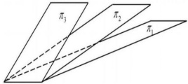

# 2024 年全国硕士研究生招生考试数学一真题

## 一、选择题

<!-- source: 【横版】10-26年数一真题套卷做题本.pdf; PDF 第 320 页 -->

### 第 1 题

已知函数  $f(x)=\int_{0}^{x}e^{\cos t}dt$,  $g(x)=\int_{0}^{\sin x}e^{t^{2}}dt$, 则

A. $f(x)$ 为奇函数,  $g(x)$ 为偶函数.

B. $f(x)$ 为偶函数,  $g(x)$ 为奇函数

C. $f(x)$ 与  $g(x)$ 均为奇函数.

D. $f(x)$ 与  $g(x)$ 均为偶函数.

<!-- source: 【横版】10-26年数一真题套卷做题本.pdf; PDF 第 321 页 -->

### 第 2 题

设  $P = P(x, y, z)$,  $Q = Q(x, y, z)$ 均为连续函数,  $\Sigma$ 为曲面  $z = \sqrt{1 - x^2 - y^2} (x \geq 0, y \geq 0)$ 的上侧, 则  $\iint_{\Sigma} P \, \mathrm{d}y \, \mathrm{d}z + Q \, \mathrm{d}z \, \mathrm{d}x =$

A. $\iint_{\Sigma} \left( \frac{x}{z} P + \frac{y}{z} Q \right) \, \mathrm{d}x \, \mathrm{d}y$

B. $\iint_{\Sigma} \left( -\frac{x}{z} P + \frac{y}{z} Q \right) \, \mathrm{d}x \, \mathrm{d}y$

C. $\iint_{\Sigma} \left( \frac{x}{z} P - \frac{y}{z} Q \right) \, \mathrm{d}x \, \mathrm{d}y$

D. $\iint_{\Sigma} \left( -\frac{x}{z} P - \frac{y}{z} Q \right) \, \mathrm{d}x \, \mathrm{d}y$

<!-- source: 【横版】10-26年数一真题套卷做题本.pdf; PDF 第 322 页 -->

### 第 3 题

已知幂函数  $\sum_{n=0}^{\infty} a_{n} x^{n}$ 的和函数为  $\ln(2+x)$，则  $\sum_{n=0}^{\infty} na_{2n} =$

A. $-\frac{1}{6}.$

B. $-\frac{1}{3}.$

C. $\frac{1}{6}.$

D. $\frac{1}{3}.$

<!-- source: 【横版】10-26年数一真题套卷做题本.pdf; PDF 第 323 页 -->

### 第 4 题

设函数  $f(x)$ 在区间  $(-1,1)$ 内有定义,  $\lim_{x\to0}f(x)=0$, 则

A. 当  $\lim_{x\to0}\frac{f(x)}{x}=m$ 时,  $f^{\prime}(0)=m$.

B. 当  $f^{\prime}(0)=m$ 时,  $\lim_{x\to0}\frac{f(x)}{x}=m$.

C. 当  $\lim_{x\to0}f^{\prime}(x)=m$ 时,  $f^{\prime}(0)=m$.

D. 当  $f^{\prime}(0)=m$ 时,  $\lim_{x\to0}f^{\prime}(x)=m$.

<!-- source: 【横版】10-26年数一真题套卷做题本.pdf; PDF 第 324 页 -->

### 第 5 题

在空间直角坐标系  $O-xyz$ 中, 三张平面  $\pi_i: a_i x + b_i y + c_i z = d_i (i=1,2,3)$ 位置关系如图所示, 记  $a_i = (a_i, b_i, c_i), \beta_i = (a_i, b_i, c_i, d_i)$, 若  $r\begin{pmatrix} \alpha_1 \\ \alpha_2 \\ \alpha_3 \end{pmatrix} = m, r\begin{pmatrix} \beta_1 \\ \beta_2 \\ \beta_3 \end{pmatrix} = n$, 则

A. $m = 1, n = 2$.

B. $m = n = 2$.

C. $m = 2, n = 3$.

D. $m = n = 3$.

<!-- source: 【横版】10-26年数一真题套卷做题本.pdf; PDF 第 325 页 -->

### 第 6 题

设向量  $\alpha_{1}=\left(\begin{array}{c}a \\ 1 \\ -1 \\ 1\end{array}\right)$,  $\alpha_{2}=\left(\begin{array}{c}1 \\ 1 \\ b \\ a\end{array}\right)$,  $\alpha_{3}=\left(\begin{array}{c}1 \\ a \\ -1 \\ 1\end{array}\right)$, 若  $\alpha_{1},\alpha_{2},\alpha_{3}$ 线性相关，且其中任意两个向量均线性无关，则

A. a=1,b\neq-1

B. a=1,b=-1

C. a\neq-2,b=2

D. a=-2,b=2

<!-- source: 【横版】10-26年数一真题套卷做题本.pdf; PDF 第 326 页 -->

### 第 7 题

设 A 是秩为 2 的 3 阶矩阵,  $\alpha$ 是满足  $A\alpha=0$ 的非零向量, 若对满足  $\beta^{T}\alpha=0$ 的任意向量  $\beta$, 均有  $A\beta=\beta$, 则

A. $A^{3}$ 的迹为 2.

B. $A^{3}$ 的迹为 5.

C. $A^{5}$ 的迹为 7.

D. $A^{5}$ 的迹为 9.

<!-- source: 【横版】10-26年数一真题套卷做题本.pdf; PDF 第 327 页 -->

### 第 8 题

设随机变量  $X$ 与  $Y$ 相互独立,  $X$ 是服从  $N(0,2)$ 的正态分布,  $Y$ 是服从  $N(-2,2)$ 的正态分布, 若  $P\{2X + Y < a\} = P\{X > Y\}$, 则  $a =$

A. $-2 - \sqrt{10}$ \quad

B. $-2 + \sqrt{10}$ \quad

C. $-2 - \sqrt{6}$ \quad

D. $-2 + \sqrt{6}$

<!-- source: 【横版】10-26年数一真题套卷做题本.pdf; PDF 第 328 页 -->

### 第 9 题

设随机变量 X 的概率密度为  $f(x)=\left\{\begin{aligned}&2(1-x),&0<x<1\\&0,& 其他 \end{aligned}\right.$，在 X=x 的条件下，Y 在区间  $(x,1)$ 上服从均匀分布，则  $\mathrm{cov}(X,Y)=$

A. $-\frac{1}{36}$

B. $-\frac{1}{72}$

C. $\frac{1}{72}$

D. $\frac{1}{36}$

<!-- source: 【横版】10-26年数一真题套卷做题本.pdf; PDF 第 329 页 -->

### 第 10 题

设随机变量 X 和 Y 相互独立, 且都服从参数为  $\lambda$ 的指数分布, 令 Z = |X - Y|, 则下列与 Z 服从同一分布的是

A. $X + Y$

B. $\frac{X + Y}{2}$

C. 2X

D. X

## 二、填空题

<!-- source: 【横版】10-26年数一真题套卷做题本.pdf; PDF 第 330 页 -->

### 第 11 题

若  $\lim_{x \to 0} \frac{(1 + ax^2)^{\sin x} - 1}{x^3} = 6$，则  $a =$ ________.

<!-- source: 【横版】10-26年数一真题套卷做题本.pdf; PDF 第 331 页 -->

### 第 12 题

$z = f(u, v)$ 有二阶连续导数,  $df\Big|_{(1,1)} = 3du + 4dv$,  $y = f(\cos x, 1 + x^2)$, 则  $\frac{d^2y}{dx^2}\Big|_{x=0} =$ ________.

<!-- source: 【横版】10-26年数一真题套卷做题本.pdf; PDF 第 332 页 -->

### 第 13 题

若函数  $f(x) = x + 1$，若  $f(x) = \frac{a_0}{2} + \sum_{n=1}^{\infty} a_n \cos nx$， $x \in [0, \pi]$，则极限  $\lim_{n \to \infty} n^2 \sin a_{2n-1} =$ ________.

<!-- source: 【横版】10-26年数一真题套卷做题本.pdf; PDF 第 333 页 -->

### 第 14 题

微分方程  $y' = \frac{1}{(x+y)^2}$，满足条件  $y(1) = 0$ 的解为 ________.

<!-- source: 【横版】10-26年数一真题套卷做题本.pdf; PDF 第 334 页 -->

### 第 15 题

设实矩阵  $A = \begin{pmatrix} a+1 & a \\ a & a \end{pmatrix}$，若对任意实向量  $\alpha = \begin{pmatrix} x_1 \\ x_2 \end{pmatrix}$,  $\beta = \begin{pmatrix} y_1 \\ y_2 \end{pmatrix}$,  $(\alpha^T A \beta)^2 \leqslant \alpha^T A \alpha \beta^T A \beta$ 都成立，则 a 的取值范围为 ________.

<!-- source: 【横版】10-26年数一真题套卷做题本.pdf; PDF 第 335 页 -->

### 第 16 题

随机试验每次成功的概率为 p, 现进行三次独立重复实验, 已知至少成功一次的条件下全部成功的概率为  $\frac{4}{13}$, 则 p = ________.

## 三、解答题

<!-- source: 【横版】10-26年数一真题套卷做题本.pdf; PDF 第 336 页 -->

### 第 17 题（10 分）

已知平面区域 $D=\left\{(x,y)\mid\sqrt{1-y^{2}}\leqslant x\leqslant1,-1\leqslant y\leqslant1\right\}$，计算 $\iint_{D}\frac{x}{\sqrt{x^{2}+y^{2}}}d\sigma$.

<!-- source: 【横版】10-26年数一真题套卷做题本.pdf; PDF 第 337 页 -->

### 第 18 题（12 分）

设  $f(x,y)=x^{3}+y^{3}-(x+y)^{2}+3$，曲面  $z=f(x,y)$ 在  $(1,1,1)$ 处的切平面为 T，T 与三个坐标面所围有界区域在 xoy 面的投影为

D.

（1） 求 T 的方程

（2） 求  $f(x, y)$ 在 D 上的最大值和最小值

<!-- source: 【横版】10-26年数一真题套卷做题本.pdf; PDF 第 338 页 -->

### 第 19 题

设  $f(x)$ 二阶可导,  $f'(0) = f'(0)$,  $\left|f''(x)\right| \leqslant 1$, 证:

（1） $|f(x)-f(0)(1-x)-f(1)x|\leqslant\frac{x(1-x)}{2}$

（2） $\left|\int_{0}^{1}f(x)dx-\frac{f(0)+f(1)}{2}\right|\leqslant\frac{1}{12}.$

<!-- source: 【横版】10-26年数一真题套卷做题本.pdf; PDF 第 339 页 -->

### 第 20 题（12 分）

已知有向曲线 L 为球面  $x^2 + y^2 + z^2 = 2x$ 与平面  $2x - z - 1 = 0$ 的交线从 z 轴正向往 z 轴负向看去为逆时针方向, 计算曲线积分  $\int_r (6xyz - yz^2) \, \mathrm{d}x + 2x^2z \, \mathrm{d}y + xyz \, \mathrm{d}z$.

<!-- source: 【横版】10-26年数一真题套卷做题本.pdf; PDF 第 340 页 -->

### 第 21 题（12 分）

已知数列 $\{x_{n}\}$， $\{y_{n}\}$， $\{z_{n}\}$满足 $x_{0}=-1,y_{0}=0,z_{0}=2$且

$$
\left\{\begin{aligned}x_{n}=&-2x_{n-1}+2z_{n-1}\\ y_{n}=&-2y_{n-1}-2z_{n-1}\\ z_{n}=&-6x_{n-1}-3y_{n-1}+3z_{n-1}\end{aligned}\right.,
$$

记 $a_{n}=\left\{\begin{aligned}x_{n}\\ y_{n}\\ z_{n}\end{aligned}\right\}$，写出满足 $a_{n}=Aa_{n-1}$的矩阵A，并求 $A^{n}$及 $x_{n},y_{n},z_{n}(n=1,2,\cdots)$.

<!-- source: 【横版】10-26年数一真题套卷做题本.pdf; PDF 第 341 页 -->

### 第 22 题（12 分）

设总体  $X \sim U(0, \theta)$， $\theta$ 未知， $X_{1}, X_{2} \cdots X_{n}$ 为简单随机样本，

$$
X_{(n)}=\max\big(X_{1},X_{2}\cdots X_{n}\big),T_{c}=c X_{(n)}.
$$

（1） 求 c 时，使得  $T_{c}$ 为  $\theta$ 的无偏估计.

小值
