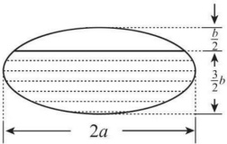

# 2010 年全国硕士研究生招生考试数学二真题

## 一、选择题

<!-- source: 【横版】10-26年数二真题套卷做题本.pdf; PDF 第 1 页 -->

### 第 1 题

函数 $f(x)=\frac{x^{2}-x}{x^{2}-1}\sqrt{1+\frac{1}{x^{2}}}$ 的无穷间断点的个数为（ ）。

A. $0$

B. $1$

C. $2$

D. $3$

<!-- source: 【横版】10-26年数二真题套卷做题本.pdf; PDF 第 2 页 -->

### 第 2 题

设 $y_1,y_2$ 是一阶线性非齐次微分方程 $y'+p(x)y=q(x)$ 的两个特解。若常数 $\lambda,\mu$ 使 $\lambda y_1+\mu y_2$ 是该方程的解，$\lambda y_1-\mu y_2$ 是该方程对应的齐次方程的解，则（ ）。

A. $\lambda=\frac{1}{2},\ \mu=\frac{1}{2}$

B. $\lambda=-\frac{1}{2},\ \mu=-\frac{1}{2}$

C. $\lambda=\frac{2}{3},\ \mu=\frac{1}{3}$

D. $\lambda=\frac{2}{3},\ \mu=\frac{2}{3}$

<!-- source: 【横版】10-26年数二真题套卷做题本.pdf; PDF 第 3 页 -->

### 第 3 题

曲线 $y=x^{2}$ 与曲线 $y=a\ln x\ (a\ne0)$ 相切，则 $a=$（ ）。

A. $4e$

B. $3e$

C. $2e$

D. $e$

<!-- source: 【横版】10-26年数二真题套卷做题本.pdf; PDF 第 4 页 -->

### 第 4 题

设 $m,n$ 均是正整数，则反常积分 $\displaystyle\int_{0}^{1}\frac{\sqrt[m]{\ln^{2}(1-x)}}{\sqrt[n]{x}}\,\mathrm{d}x$ 的收敛性（ ）。

A. 仅与 $m$ 的取值有关

B. 仅与 $n$ 的取值有关

C. 与 $m,n$ 的取值都有关系

D. 与 $m,n$ 的取值都无关

<!-- source: 【横版】10-26年数二真题套卷做题本.pdf; PDF 第 5 页 -->

### 第 5 题

设函数 $z=z(x,y)$ 由方程 $F\left(\frac{y}{x},\frac{z}{x}\right)=0$ 确定，其中 $F$ 为可微函数，且 $F_2'\ne0$，则 $x\frac{\partial z}{\partial x}+y\frac{\partial z}{\partial y}=$（ ）。

A. $x$

B. $z$

C. $-x$

D. $-z$

<!-- source: 【横版】10-26年数二真题套卷做题本.pdf; PDF 第 6 页 -->

### 第 6 题

$$
\lim_{n\to\infty}\sum_{i=1}^{n}\sum_{j=1}^{n}\frac{n}{(n+i)(n^{2}+j^{2})}
$$
等于（ ）。

A. $\displaystyle\int_{0}^{1}\mathrm{d}x\int_{0}^{x}\frac{1}{(1+x)(1+y^{2})}\,\mathrm{d}y$

B. $\displaystyle\int_{0}^{1}\mathrm{d}x\int_{0}^{x}\frac{1}{(1+x)(1+y)}\,\mathrm{d}y$

C. $\displaystyle\int_{0}^{1}\mathrm{d}x\int_{0}^{1}\frac{1}{(1+x)(1+y)}\,\mathrm{d}y$

D. $\displaystyle\int_{0}^{1}\mathrm{d}x\int_{0}^{1}\frac{1}{(1+x)(1+y^{2})}\,\mathrm{d}y$

<!-- source: 【横版】10-26年数二真题套卷做题本.pdf; PDF 第 7 页 -->

### 第 7 题

设向量组 $I:\alpha_1,\alpha_2,\cdots,\alpha_r$ 可由向量组 $II:\beta_1,\beta_2,\cdots,\beta_s$ 线性表示。下列命题正确的是（ ）。

A. 若向量组 $I$ 线性无关，则 $r\leq s$

B. 若向量组 $I$ 线性相关，则 $r>s$

C. 若向量组 $II$ 线性无关，则 $r\leq s$

D. 若向量组 $II$ 线性相关，则 $r>s$

<!-- source: 【横版】10-26年数二真题套卷做题本.pdf; PDF 第 8 页 -->

### 第 8 题

设 $A$ 为 $4$ 阶实对称矩阵，则 $A^{2}+A=O$。若 $A$ 的秩为 $3$，则 $A$ 相似于（ ）。

A. $\displaystyle\begin{pmatrix}1&0&0&0\\0&1&0&0\\0&0&1&0\\0&0&0&0\end{pmatrix}$

B. $\displaystyle\begin{pmatrix}1&0&0&0\\0&1&0&0\\0&0&-1&0\\0&0&0&0\end{pmatrix}$

C. $\displaystyle\begin{pmatrix}1&0&0&0\\0&-1&0&0\\0&0&-1&0\\0&0&0&0\end{pmatrix}$

D. $\displaystyle\begin{pmatrix}-1&0&0&0\\0&-1&0&0\\0&0&-1&0\\0&0&0&0\end{pmatrix}$

## 二、填空题

<!-- source: 【横版】10-26年数二真题套卷做题本.pdf; PDF 第 9 页 -->

### 第 9 题

三阶常系数线性齐次微分方程 $y'''-2y''+y'-2y=0$ 的通解为 $y=$ ________。

<!-- source: 【横版】10-26年数二真题套卷做题本.pdf; PDF 第 10 页 -->

### 第 10 题

曲线 $y=\frac{2x^{3}}{x^{2}+1}$ 的渐近线方程为 ________。

<!-- source: 【横版】10-26年数二真题套卷做题本.pdf; PDF 第 11 页 -->

### 第 11 题

函数 $y=\ln(1-2x)$ 在 $x=0$ 处的 $n$ 阶导数 $y^{(n)}(0)=$ ________。

<!-- source: 【横版】10-26年数二真题套卷做题本.pdf; PDF 第 12 页 -->

### 第 12 题

当 $0\leq\theta\leq\pi$ 时，对数螺线 $r=e^{\theta}$ 的弧长为 ________。

<!-- source: 【横版】10-26年数二真题套卷做题本.pdf; PDF 第 13 页 -->

### 第 13 题

已知一个长方形的长 $l$ 以 $2\,\mathrm{cm/s}$ 的速率增加，宽 $w$ 以 $3\,\mathrm{cm/s}$ 的速率增加，则当 $l=12\,\mathrm{cm}$，$w=5\,\mathrm{cm}$ 时，它的对角线增加的速率为 ________。

<!-- source: 【横版】10-26年数二真题套卷做题本.pdf; PDF 第 14 页 -->

### 第 14 题

设 $A,B$ 为 $3$ 阶矩阵，且 $|A|=3$，$|B|=2$，$|A^{-1}+B|=2$，则 $|A+B^{-1}|=$ ________。

## 三、解答题

<!-- source: 【横版】10-26年数二真题套卷做题本.pdf; PDF 第 15 页 -->

### 第 15 题（10 分）

求函数 $\displaystyle f(x)=\int_{1}^{x^{2}}(x^{2}-t)e^{-t^{2}}\,\mathrm{d}t$ 的单调区间与极值。

<!-- source: 【横版】10-26年数二真题套卷做题本.pdf; PDF 第 16 页 -->

### 第 16 题（10 分）

（I）比较 $\displaystyle\int_{0}^{1}|\ln t|[\ln(1+t)]^{n}\,\mathrm{d}t$ 与 $\displaystyle\int_{0}^{1}t^{n}|\ln t|\,\mathrm{d}t\ (n=1,2,\cdots)$ 的大小，说明理由。

（II）记 $\displaystyle u_n=\int_{0}^{1}|\ln t|[\ln(1+t)]^{n}\,\mathrm{d}t\ (n=1,2,\cdots)$，求极限 $\displaystyle\lim_{n\to\infty}u_n$。

<!-- source: 【横版】10-26年数二真题套卷做题本.pdf; PDF 第 17 页 -->

### 第 17 题（11 分）

设函数 $y=f(x)$ 由参数方程 $\begin{cases}x=2t+t^{2},\\y=\psi(t)\end{cases}\ (t>-1)$ 所确定，其中 $\psi(t)$ 具有二阶导数，且 $\psi(1)=\frac{5}{2}$，$\psi'(1)=6$。已知 $\displaystyle\frac{\mathrm{d}^{2}y}{\mathrm{d}x^{2}}=\frac{3}{4(1+t)}$，求函数 $\psi(t)$。

<!-- source: 【横版】10-26年数二真题套卷做题本.pdf; PDF 第 18 页 -->

### 第 18 题（10 分）

一个高为 $l$ 的柱体形贮油罐，底面是长轴为 $2a$、短轴为 $2b$ 的椭圆。现将贮油罐平放，当油罐中油面高度为 $\frac{3}{2}b$ 时（如图），计算油的质量。（长度单位为 $m$，质量单位为 $kg$，油的密度为常量 $\rho$，单位为 $kg/m^{3}$。）

<!-- source: 【横版】10-26年数二真题套卷做题本.pdf; PDF 第 19 页 -->

### 第 19 题（11 分）

设函数 $u=f(x,y)$ 具有二阶连续偏导数，且满足等式

$$
4\frac{\partial^{2}u}{\partial x^{2}}+12\frac{\partial^{2}u}{\partial x\partial y}+5\frac{\partial^{2}u}{\partial y^{2}}=0
$$

确定 $a,b$ 的值，使等式在变换 $\xi=x+ay,\ \eta=x+by$ 下简化为

$$
\frac{\partial^{2}u}{\partial\xi\partial\eta}=0
$$

。

<!-- source: 【横版】10-26年数二真题套卷做题本.pdf; PDF 第 20 页 -->

### 第 20 题（10 分）

计算二重积分

$$
I=\iint_{D}r^{2}\sin\theta\sqrt{1-r^{2}\cos 2\theta}\,\mathrm{d}r\,\mathrm{d}\theta
$$

，其中

$$
D=\left\{(r,\theta)\middle|0\leq r\leq\sec\theta,\ 0\leq\theta\leq\frac{\pi}{4}\right\}
$$

。

<!-- source: 【横版】10-26年数二真题套卷做题本.pdf; PDF 第 21 页 -->

### 第 21 题（10 分）

设函数 $f(x)$ 在闭区间 $[0,1]$ 上连续，在开区间 $(0,1)$ 内可导，且 $f(0)=0$，$f(1)=\frac{1}{3}$。证明：存在

$$
\xi\in\left(0,\frac{1}{2}\right),\qquad\eta\in\left(\frac{1}{2},1\right)
$$

，使得

$$
f'(\xi)+f'(\eta)=\xi^{2}+\eta^{2}
$$

。

<!-- source: 【横版】10-26年数二真题套卷做题本.pdf; PDF 第 22 页 -->

### 第 22 题（11 分）

设

$$
A=\begin{pmatrix}\lambda&1&1\\0&\lambda-1&0\\1&1&\lambda\end{pmatrix},\qquad b=\begin{pmatrix}a\\1\\1\end{pmatrix}
$$

已知线性方程组 $Ax=b$ 存在两个不同的解。

（I）求 $\lambda,a$；

（II）求方程组 $Ax=b$ 的通解。

<!-- source: 【横版】10-26年数二真题套卷做题本.pdf; PDF 第 23 页 -->

### 第 23 题（11 分）

设

$$
A=\begin{pmatrix}0&-1&4\\-1&3&a\\4&a&0\end{pmatrix}
$$

正交矩阵 $Q$ 使 $Q^{T}AQ$ 为对角矩阵。若 $Q$ 的第 1 列为

$$
\frac{1}{\sqrt{6}}(1,2,1)^{T}
$$

，求 $a,Q$。
