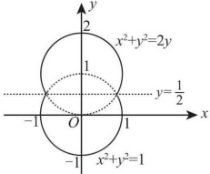

# 2011 年全国硕士研究生招生考试数学二真题

## 一、选择题

<!-- source: 【横版】10-26年数二真题套卷做题本.pdf; PDF 第 24 页 -->

### 第 1 题

已知当  $x \to 0$ 时，函数  $f(x) = 3\sin x - \sin 3x$ 与  $cx^k$ 是等价无穷小量，则 ( )

A. $k = 1, c = 4.$

B. $k = 1, c = -4.$

C. $k = 3, c = 4.$

D. $k = 3, c = -4.$

<!-- source: 【横版】10-26年数二真题套卷做题本.pdf; PDF 第 25 页 -->

### 第 2 题

设函数  $f(x)$ 在 x=0 处可导，且  $f(0)=0$，则  $\lim_{x\to0}\frac{x^2f(x)-2f(x^3)}{x^3}=$ ( )

A. $-2f'(0)$.

B. $-f'(0)$.

C. $f'(0)$.

D. 0.

<!-- source: 【横版】10-26年数二真题套卷做题本.pdf; PDF 第 26 页 -->

### 第 3 题

函数  $f(x)=\ln|(x-1)(x-2)(x-3)|$ 的驻点个数为()

A. 0.

B. 1.

C. 2.

D. 3.

<!-- source: 【横版】10-26年数二真题套卷做题本.pdf; PDF 第 27 页 -->

### 第 4 题

微分方程  $y'' - \lambda^2 y = e^{\lambda x} + e^{-\lambda x} (\lambda > 0)$ 的特解形式为 ( )

A. $a(e^{\lambda x} + e^{-\lambda x}).$

B. $ax(e^{\lambda x} + e^{-\lambda x}).$

C. $x(ae^{\lambda x} + be^{-\lambda x}).$

D. $x^2(ae^{\lambda x} + be^{-\lambda x}).$

<!-- source: 【横版】10-26年数二真题套卷做题本.pdf; PDF 第 28 页 -->

### 第 5 题

设函数  $f(x), g(x)$ 均有二阶连续导数，满足  $f(0) > 0, g(0) < 0$，且  $f'(0) = g'(0) = 0$，则函数  $z = f(x)g(y)$ 在点  $(0,0)$ 处取得极小值的一个充分条件是（ ）

A. $f''(0) < 0, g''(0) > 0$.

B. $f''(0) < 0, g''(0) < 0$.

C. $f''(0) > 0, g''(0) > 0$.

D. $f''(0) > 0, g''(0) < 0$.

<!-- source: 【横版】10-26年数二真题套卷做题本.pdf; PDF 第 29 页 -->

### 第 6 题

设  $I=\int_{0}^{\frac{\pi}{4}}\ln(\sin x)\,\mathrm{d}x$,  $J=\int_{0}^{\frac{\pi}{4}}\ln(\cot x)\,\mathrm{d}x$,  $K=\int_{0}^{\frac{\pi}{4}}\ln(\cos x)\,\mathrm{d}x$，则 I, J, K 的大小关系为 ( )

A. I < J < K.

B. I < K < J.

C. J < I < K.

D. K < J < I.

<!-- source: 【横版】10-26年数二真题套卷做题本.pdf; PDF 第 30 页 -->

### 第 7 题

设  $A$ 为 3 阶矩阵, 将  $A$ 的第 2 列加到第 1 列得矩阵  $B$, 再交换  $B$ 的第 2 行与第 3 行得单位矩阵. 记  $P_1 = \begin{pmatrix} 1 & 0 & 0 \\ 1 & 1 & 0 \\ 0 & 0 & 1 \end{pmatrix}, P_2 = \begin{pmatrix} 1 & 0 & 0 \\ 0 & 0 & 1 \\ 0 & 1 & 0 \end{pmatrix}$, 则  $A = (\ )$.

A. $P_1 P_2$.

B. $P_1^{-1} P_2$.

C. $P_2 P_1$.

D. $P_2 P_1^{-1}$.

<!-- source: 【横版】10-26年数二真题套卷做题本.pdf; PDF 第 31 页 -->

### 第 8 题

设  $A = (a_1, a_2, a_3, a_4)$ 是 4 阶矩阵， $A^*$ 为  $A$ 的伴随矩阵。若  $(1, 0, 1, 0)^T$ 是方程组  $Ax = 0$ 的一个基础解系，则  $A^*x = 0$ 的基础解系可为（ ）

A. $a_1, a_3$.

B. $a_1, a_2$.

C. $a_1, a_2, a_3$.

D. $a_2, a_3, a_4$.

## 二、填空题

<!-- source: 【横版】10-26年数二真题套卷做题本.pdf; PDF 第 32 页 -->

### 第 9 题

$\lim_{x\to0}\left(\frac{1+2^x}{2}\right)^{\frac{1}{x}}=$ ________.

<!-- source: 【横版】10-26年数二真题套卷做题本.pdf; PDF 第 33 页 -->

### 第 10 题

微分方程  $y' + y = e^{-x} \cos x$ 满足条件  $y(0) = 0$ 的解为  $y =$ ________.

<!-- source: 【横版】10-26年数二真题套卷做题本.pdf; PDF 第 34 页 -->

### 第 11 题

曲线  $y = \int_0^x \tan t \, dt$  $(0 \leq x \leq \frac{\pi}{4})$ 的弧长  $s =$ ________.

<!-- source: 【横版】10-26年数二真题套卷做题本.pdf; PDF 第 35 页 -->

### 第 12 题

设函数  $f(x) = \begin{cases} \lambda e^{-\lambda x} & x > 0, \\ 0, & x \leq 0, \end{cases}$  $\lambda > 0$，则  $\int_{-\infty}^{+\infty} x f(x) \, dx =$ ________.

<!-- source: 【横版】10-26年数二真题套卷做题本.pdf; PDF 第 36 页 -->

### 第 13 题

设平面区域  $D$ 由直线  $y = x$, 圆  $x^2 + y^2 = 2y$ 及  $y$ 轴所围成, 则二重积分  $\iint_D xyd\sigma =$ ________.

<!-- source: 【横版】10-26年数二真题套卷做题本.pdf; PDF 第 37 页 -->

### 第 14 题

二次型  $f(x_1,x_2,x_3)=x_1^2+3x_2^2+x_3^2+2x_1x_2+2x_1x_3+2x_2x_3$，则  $f$ 的正惯性指数为 ________.

## 三、解答题

<!-- source: 【横版】10-26年数二真题套卷做题本.pdf; PDF 第 38 页 -->

### 第 15 题（10 分）

已知函数  $F(x)=\frac{\int_{0}^{x}\ln(1+t^{2})dt}{x^{\alpha}}$. 设  $\lim_{x\to+\infty}F(x)=\lim_{x\to0^{+}}F(x)=0$，试求  $\alpha$ 的取值范围.

<!-- source: 【横版】10-26年数二真题套卷做题本.pdf; PDF 第 39 页 -->

### 第 16 题（11 分）

设函数  $y = y(x)$ 由参数方程  $\left\{\begin{aligned} x &= \frac{1}{3}t^{3} + t + \frac{1}{3}, \\ y &= \frac{1}{3}t^{3} - t + \frac{1}{3} \end{aligned}\right.$ 确定，求  $y = y(x)$ 的极值和曲线  $y = y(x)$ 的凹凸区间及拐点.

<!-- source: 【横版】10-26年数二真题套卷做题本.pdf; PDF 第 40 页 -->

### 第 17 题（9 分）

设函数  $z = f(xy, yg(x))$，其中函数  $f$ 具有二阶连续偏导数，函数  $g(x)$ 可导且在  $x = 1$ 处取得极值  $g(1) = 1$，求  $\frac{\partial^2 z}{\partial x \partial y} \bigg|_{x=1 \atop y=1}$

<!-- source: 【横版】10-26年数二真题套卷做题本.pdf; PDF 第 41 页 -->

### 第 18 题（10 分）

设函数  $y(x)$ 具有二阶导数，且曲线  $l:y=y(x)$ 与直线 y=x 相切于原点。记 a 为曲线 l 在点  $(x,y)$ 处切线的倾角，若  $\frac{da}{dx}=\frac{dy}{dx}$，求  $y(x)$ 的表达式。

<!-- source: 【横版】10-26年数二真题套卷做题本.pdf; PDF 第 42 页 -->

### 第 19 题（10 分）

(I) 证明: 对任意的正整数 n, 都有  $\frac{1}{n+1} < \ln\left(1 + \frac{1}{n}\right) < \frac{1}{n}$ 成立;

(II) 设  $a_n = 1 + \frac{1}{2} + \cdots + \frac{1}{n} - \ln n (n = 1, 2, \cdots)$，证明数列  $\{a_n\}$ 收敛.

<!-- source: 【横版】10-26年数二真题套卷做题本.pdf; PDF 第 43 页 -->

### 第 20 题（11 分）

一容器的内侧是由图中曲线绕y轴旋转一周而成的曲面,该曲线由 $x^{2}+y^{2}=2y\left(y\geqslant\frac{1}{2}\right)$与 $x^{2}+y^{2}=1\left(y\leqslant\frac{1}{2}\right)$连接而成.

(I) 求容器的容积;

(II) 若将容器内盛满的水从容器顶部全部抽出, 至少需要做多少功?

(长度单位:m, 重力加速度为  $g \, m/s^{2}$, 水的密度为  $10^{3} \, kg/m^{3}$)

<!-- source: 【横版】10-26年数二真题套卷做题本.pdf; PDF 第 44 页 -->

### 第 21 题（11 分）

已知函数 $f(x,y)$具有二阶连续偏导数，且 $f(1,y)=f(x,1)=0$， $\iint_{D}f(x,y)\mathrm{d}x\mathrm{d}y=a$，其中 $D=\{(x,y)|0\leqslant x\leqslant1,0\leqslant y\leqslant1\}$，计算二重积分 $I=\iint_{D}xyf_{xy}''(x,y)\mathrm{d}x\mathrm{d}y$。

<!-- source: 【横版】10-26年数二真题套卷做题本.pdf; PDF 第 45 页 -->

### 第 22 题（11 分）

设向量组  $\alpha_{1}=(1,0,1)^{T}$， $\alpha_{2}=(0,1,1)^{T}$， $\alpha_{3}=(1,3,5)^{T}$ 不能由向量组  $\beta_{1}=(1,1,1)^{T}$， $\beta_{2}=(1,2,3)^{T}$， $\beta_{3}=(3,4,a)^{T}$ 线性表示.

(I) 求 a 的值;

(II) 将  $\beta_{1}, \beta_{2}, \beta_{3}$ 用  $a_{1}, a_{2}, a_{3}$ 线性表示.

<!-- source: 【横版】10-26年数二真题套卷做题本.pdf; PDF 第 46 页 -->

### 第 23 题（11 分）

设A为3阶实对称矩阵，A的秩为2，且 $A\begin{pmatrix}1&1\\0&0\\-1&1\end{pmatrix}=\begin{pmatrix}-1&1\\0&0\\1&1\end{pmatrix}$.

(I) 求 A 的所有特征值与特征向量;

(II) 求矩阵 A.
