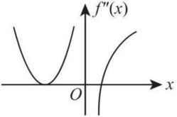

# 2015 年全国硕士研究生招生考试数学二真题

## 一、选择题

<!-- source: 【横版】10-26年数二真题套卷做题本.pdf; PDF 第 116 页 -->

### 第 1 题

下列反常积分中收敛的是()

A. $\int_{2}^{+\infty}\frac{1}{\sqrt{x}}dx.$

B. $\int_{2}^{+\infty}\frac{\ln x}{x}dx.$

C. $\int_{2}^{+\infty}\frac{1}{x\ln x}dx.$

D. $\int_{2}^{+\infty}\frac{x}{e^{x}}dx.$

<!-- source: 【横版】10-26年数二真题套卷做题本.pdf; PDF 第 117 页 -->

### 第 2 题

函数  $f(x)=\lim_{t\to0}\left(1+\frac{\sin t}{x}\right)^{\frac{x^{2}}{t}}$ 在  $(-\infty,+\infty)$ ()

A. 连续.

B. 有可去间断点.

C. 有跳跃间断点.

D. 有无穷间断点.

<!-- source: 【横版】10-26年数二真题套卷做题本.pdf; PDF 第 118 页 -->

### 第 3 题

设函数  $f(x)=\begin{cases}x^a\cos\frac{1}{x^b},&x>0,\\0,&x\leq0\end{cases}$ ( $a>0,b>0$). 若  $f'(x)$ 在 x=0 处连续，则（）

A. $\alpha - \beta > 1$.

B. $0 < \alpha - \beta \leq 1$.

C. $\alpha - \beta > 2$.

D. $0 < \alpha - \beta \leq 2$.

<!-- source: 【横版】10-26年数二真题套卷做题本.pdf; PDF 第 119 页 -->

### 第 4 题

设函数在  $(-\infty, +\infty)$ 内连续, 其 2 阶导函数  $f''(x)$ 的图形如右图所示, 则曲线  $y = f(x)$ 的拐点个数为()

为()

为()

A. 0.

B. 1.

C. 2.

D. 3.

<!-- source: 【横版】10-26年数二真题套卷做题本.pdf; PDF 第 120 页 -->

### 第 5 题

设函数  $f(u,v)$ 满足  $f\left(x+y,\frac{y}{x}\right)=x^{2}-y^{2}$，则  $\left.\frac{\partial f}{\partial u}\right|_{u=1},\left.\frac{\partial f}{\partial v}\right|_{u=1}$，依次是（ ）

A. $\frac{1}{2},0.$

B. $0,\frac{1}{2}.$

C. $-\frac{1}{2},0.$

D. $0,-\frac{1}{2}.$

<!-- source: 【横版】10-26年数二真题套卷做题本.pdf; PDF 第 121 页 -->

### 第 6 题

设 $D$ 是第一象限中由曲线 $2xy = 1, 4xy = 1$ 与直线 $y = x, y = \sqrt{3}x$ 围成的平面区域，函数 $f(x, y)$ 在 $D$ 上连续，则 $\iint_{D} f(x, y) \, \mathrm{d}x \, \mathrm{d}y = (\quad)$

A. $\int_{\frac{\pi}{4}}^{\frac{\pi}{3}} d\theta \int_{\frac{1}{2\sin2\theta}}^{\frac{1}{\sin2\theta}} f(r\cos\theta, r\sin\theta) r \, dr$.

B. $\int_{\frac{\pi}{4}}^{\frac{\pi}{3}} d\theta \int_{\frac{1}{\sqrt{2}\sin2\theta}}^{\frac{1}{\sqrt{2}\sin2\theta}} f(r\cos\theta, r\sin\theta) r \, dr$.

C. $\int_{\frac{\pi}{4}}^{\frac{\pi}{3}} d\theta \int_{\frac{1}{2\sin2\theta}}^{\frac{1}{\sin2\theta}} f(r\cos\theta, r\sin\theta) r \, dr$.

D. $\int_{\frac{\pi}{4}}^{\frac{\pi}{3}} d\theta \int_{\frac{1}{\sqrt{2}\sin2\theta}}^{\frac{1}{\sqrt{2}\sin2\theta}} f(r\cos\theta, r\sin\theta) r \, dr$.

<!-- source: 【横版】10-26年数二真题套卷做题本.pdf; PDF 第 122 页 -->

### 第 7 题

设矩阵  $A = \begin{pmatrix} 1 & 1 & 1 \\ 1 & 2 & a \\ 1 & 4 & a^2 \end{pmatrix}$,  $b = \begin{pmatrix} 1 & & \\ d & & \\ d^2 & & \end{pmatrix}$. 若集合  $\Omega = \{1,2\}$，则线性方程组 Ax = b 有无穷多解的充分必要条件为 ( )

A. $a \notin \Omega, d \notin \Omega$. \quad

B. $a \notin \Omega, d \in \Omega$. \quad

C. $a \in \Omega, d \notin \Omega$. \quad

D. $a \in \Omega, d \in \Omega$.

<!-- source: 【横版】10-26年数二真题套卷做题本.pdf; PDF 第 123 页 -->

### 第 8 题

设二次型  $f(x_1, x_2, x_3)$ 在正交变换  $x = Py$ 下的标准形为  $2y_1^2 + y_2^2 - y_3^2$，其中  $P = (e_1, e_2, e_3)$。若  $Q = (e_1, -e_3, e_2)$，则  $f(x_1, x_2, x_3)$ 在正交变换  $x = Qy$ 下的标准形为（ ）

A. $2y_1^2 - y_2^2 + y_3^2$.

B. $2y_1^2 + y_2^2 - y_3^2$.

C. $2y_1^2 - y_2^2 - y_3^2$.

D. $2y_1^2 + y_2^2 + y_3^2$.

## 二、填空题

<!-- source: 【横版】10-26年数二真题套卷做题本.pdf; PDF 第 124 页 -->

### 第 9 题

设  $\begin{cases} x = \arctan t, \\ y = 3t + t^3, \end{cases}$ 则  $\left. \frac{d^2y}{dx^2} \right|_{t=1} =$ ________.

<!-- source: 【横版】10-26年数二真题套卷做题本.pdf; PDF 第 125 页 -->

### 第 10 题

函数  $f(x)=x^{2}2^{x}$ 在 x=0 处的 n 阶导数  $f^{(n)}(0)=$ ________.

<!-- source: 【横版】10-26年数二真题套卷做题本.pdf; PDF 第 126 页 -->

### 第 11 题

设函数  $f(x)$ 连续,  $\varphi(x) = \int_0^{x^2} x f(t) dt$. 若  $\varphi(1) = 1$,  $\varphi'(1) = 5$, 则  $f(1) =$ ________.

<!-- source: 【横版】10-26年数二真题套卷做题本.pdf; PDF 第 127 页 -->

### 第 12 题

设函数  $y = y(x)$ 是微分方程  $y'' + y' - 2y = 0$ 的解，且在 x = 0 处  $y(x)$ 取得极值 3，则  $y(x) =$ ________.

<!-- source: 【横版】10-26年数二真题套卷做题本.pdf; PDF 第 128 页 -->

### 第 13 题

若函数  $z = z(x, y)$ 由方程  $e^{x+2y+3z} + xyz = 1$ 确定，则  $dz \big|_{(0,0)} =$ ________.

<!-- source: 【横版】10-26年数二真题套卷做题本.pdf; PDF 第 129 页 -->

### 第 14 题

设 3 阶矩阵  $A$ 的特征值为 2, -2, 1,  $B = A^2 - A + E$, 其中  $E$ 为 3 阶单位矩阵, 则行列式  $|B| =$ ________.

## 三、解答题

<!-- source: 【横版】10-26年数二真题套卷做题本.pdf; PDF 第 130 页 -->

### 第 15 题（10 分）

设函数  $f(x)=x+a\ln(1+x)+bx\sin x$,  $g(x)=kx^{3}$. 若  $f(x)$ 与  $g(x)$ 在  $x\to0$ 时是等价无穷小，求 a, b, k 的值.

<!-- source: 【横版】10-26年数二真题套卷做题本.pdf; PDF 第 131 页 -->

### 第 16 题（10 分）

设  $A > 0, D$ 是由曲线段  $y = A \sin x \left( 0 \leq x \leq \frac{\pi}{2} \right)$ 及直线  $y = 0, x = \frac{\pi}{2}$ 所围成的平面区域， $V_1, V_2$ 分别表示  $D$ 绕  $x$ 轴与绕  $y$ 轴旋转所成旋转体的体积。若  $V_1 = V_2$，求  $A$ 的值。

<!-- source: 【横版】10-26年数二真题套卷做题本.pdf; PDF 第 132 页 -->

### 第 17 题（11 分）

已知函数  $f(x,y)$ 满足  $f_{xy}^{\prime\prime}(x,y)=2(y+1)\mathrm{e}^{x},f_{x}^{\prime}(x,0)=(x+1)\mathrm{e}^{x},f(0,y)=y^{2}+2y$ ，求  $f(x,y)$ 的极值.

<!-- source: 【横版】10-26年数二真题套卷做题本.pdf; PDF 第 133 页 -->

### 第 18 题（10 分）

计算二重积分  $\iint_{D} x(x+y) \, \mathrm{d}x \, \mathrm{d}y$，其中  $D = \left\{(x, y) \mid x^{2} + y^{2} \leqslant 2, y \geqslant x^{2}\right\}$.

<!-- source: 【横版】10-26年数二真题套卷做题本.pdf; PDF 第 134 页 -->

### 第 19 题（11 分）

已知函数  $f(x)=\int_{x}^{1}\sqrt{1+t^{2}}dt+\int_{1}^{x^{2}}\sqrt{1+t}dt$，求  $f(x)$ 零点的个数.

<!-- source: 【横版】10-26年数二真题套卷做题本.pdf; PDF 第 135 页 -->

### 第 20 题（10 分）

已知高温物体置于低温介质中，任一时刻该物体温度对时间的变化率与该时刻物体和介质的温差成正比。现将一初始温度为  $120^{\circ}C$ 的物体在  $20^{\circ}C$ 的恒温介质中冷却，30min 后该物体温度降至  $30^{\circ}C$，若要将该物体的温度继续降至  $21^{\circ}C$，还需冷却多长时间？

<!-- source: 【横版】10-26年数二真题套卷做题本.pdf; PDF 第 136 页 -->

### 第 21 题（10 分）

已知函数  $f(x)$ 在区间  $[a, +\infty)$ 上具有 2 阶导数,  $f(a) = 0$,  $f'(x) > 0$,  $f''(x) > 0$. 设 b > a, 曲线  $y = f(x)$ 在点  $(b, f(b))$ 处的切线与 x 轴的交点是  $(x_0, 0)$, 证明 a < x_0 < b.

<!-- source: 【横版】10-26年数二真题套卷做题本.pdf; PDF 第 137 页 -->

### 第 22 题（11 分）

设矩阵  $A=\begin{pmatrix}a&1&0\\1&a&-1\\0&1&a\end{pmatrix}$，且  $A^{3}=O$.

(I) 求 a 的值;

(II) 若矩阵 X 满足  $X - X A^{2} - A X + A X A^{2} = E$，其中 E 为 3 阶单位矩阵，求 X.

<!-- source: 【横版】10-26年数二真题套卷做题本.pdf; PDF 第 138 页 -->

### 第 23 题（11 分）

设矩阵  $A=\left(\begin{array}{ccc}0 & 2 & -3 \\ -1 & 3 & -3 \\ 1 & -2 & a\end{array}\right)$ 相似于矩阵  $B=\left(\begin{array}{ccc}1 & -2 & 0 \\ 0 & b & 0 \\ 0 & 3 & 1\end{array}\right)$.

(I) 求 a, b 的值;

(II) 求可逆矩阵 P, 使  $P^{-1}AP$ 为对角矩阵.
