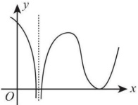

# 2016 年全国硕士研究生招生考试数学二真题

## 一、选择题

<!-- source: 【横版】10-26年数二真题套卷做题本.pdf; PDF 第 139 页 -->

### 第 1 题

设  $\alpha_1 = x (\cos \sqrt{x} - 1)$,  $\alpha_2 = \sqrt{x} \ln (1 + \sqrt[3]{x})$,  $\alpha_3 = \sqrt[3]{x + 1} - 1$. 当  $x \to 0^+$ 时, 以上 3 个无穷小量按照从低阶到高阶的排序是 ( )

A. $\alpha_1, \alpha_2, \alpha_3$.

B. $\alpha_2, \alpha_3, \alpha_1$.

C. $\alpha_2, \alpha_1, \alpha_3$.

D. $\alpha_3, \alpha_2, \alpha_1$.

<!-- source: 【横版】10-26年数二真题套卷做题本.pdf; PDF 第 140 页 -->

### 第 2 题

已知函数  $f(x)=\begin{cases}2(x-1), & x<1, \\ \ln x, & x\geq1,\end{cases}$ 则  $f(x)$ 的一个原函数是（）

A. $F(x)=\begin{cases}(x-1)^{2},&x<1,\\x(\ln x-1),&x\geqslant1.\end{cases}$

B. $F(x)=\begin{cases}(x-1)^{2},&x<1,\\x(\ln x+1)-1,&x\geqslant1.\end{cases}$

C. $F(x)=\begin{cases}(x-1)^{2},&x<1,\\x(\ln x+1)+1,&x\geqslant1.\end{cases}$

D. $F(x)=\begin{cases}(x-1)^{2},&x<1,\\x(\ln x-1)+1,&x\geqslant1.\end{cases}$

<!-- source: 【横版】10-26年数二真题套卷做题本.pdf; PDF 第 141 页 -->

### 第 3 题

反常积分①  $\int_{-\infty}^{0}\frac{1}{x^{2}}e^{\frac{1}{x}}dx$, ②  $\int_{0}^{+\infty}\frac{1}{x^{2}}e^{\frac{1}{x}}dx$ 的敛散性为()

A. ①收敛,②收敛.

B. ①收敛,②发散.

C. ①发散,②收敛.

D. ①发散,②发散.

<!-- source: 【横版】10-26年数二真题套卷做题本.pdf; PDF 第 142 页 -->

### 第 4 题

设函数  $f(x)$ 在  $(-\infty, +\infty)$ 内连续，其导函数的图形如图所示，则 ( )

A. 函数  $f(x)$ 有 2 个极值点，曲线  $y = f(x)$ 有 2 个拐点.

B. 函数  $f(x)$ 有 2 个极值点，曲线  $y = f(x)$ 有 3 个拐点.

C. 函数  $f(x)$ 有 3 个极值点，曲线  $y = f(x)$ 有 1 个拐点.

D. 函数  $f(x)$ 有 3 个极值点，曲线  $y = f(x)$ 有 2 个拐点.

<!-- source: 【横版】10-26年数二真题套卷做题本.pdf; PDF 第 143 页 -->

### 第 5 题

设函数  $f_i(x) (i=1,2)$ 具有二阶连续导数，且  $f_i''(x_0) < 0 (i=1,2)$。若两条曲线  $y = f_i(x) (i=1,2)$ 在点  $(x_0, y_0)$ 处具有公切线  $y = g(x)$，且在该点处曲线  $y = f_1(x)$ 的曲率大于曲线  $y = f_2(x)$ 的曲率，则在  $x_0$ 的某个邻域内，有（ ）

A. $f_1(x) \leq f_2(x) \leq g(x)$.

B. $f_2(x) \leq f_1(x) \leq g(x)$.

C. $f_1(x) \leq g(x) \leq f_2(x)$.

D. $f_2(x) \leq g(x) \leq f_1(x)$.

<!-- source: 【横版】10-26年数二真题套卷做题本.pdf; PDF 第 144 页 -->

### 第 6 题

已知函数 $f(x,y)=\frac{e^x}{x-y}$，则（ ）。

A. $f'_x-f'_y=0$.

B. $f'_x+f'_y=0$.

C. $f'_x-f'_y=f$.

D. $f'_x+f'_y=f$.

<!-- source: 【横版】10-26年数二真题套卷做题本.pdf; PDF 第 145 页 -->

### 第 7 题

设 A, B 是可逆矩阵，且 A 与 B 相似，则下列结论错误的是 ()

A. $A^{T}$ 与  $B^{T}$ 相似.

B. $A^{-1}$ 与  $B^{-1}$ 相似.

C. $A + A^{T}$ 与  $B + B^{T}$ 相似.

D. $A + A^{-1}$ 与  $B + B^{-1}$ 相似.

<!-- source: 【横版】10-26年数二真题套卷做题本.pdf; PDF 第 146 页 -->

### 第 8 题

设二次型  $f(x_{1}, x_{2}, x_{3}) = a(x_{1}^{2} + x_{2}^{2} + x_{3}^{2}) + 2x_{1}x_{2} + 2x_{2}x_{3} + 2x_{1}x_{3}$ 的正, 负惯性指数分别为 1, 2, 则 ( )

A. a > 1.

B. a < -2.

C. -2 < a < 1.

D. a = 1 或 a = -2.

## 二、填空题

<!-- source: 【横版】10-26年数二真题套卷做题本.pdf; PDF 第 147 页 -->

### 第 9 题

曲线  $y = \frac{x^3}{1+x^2} + \arctan(1+x^2)$ 的斜渐近线方程为 ________.

<!-- source: 【横版】10-26年数二真题套卷做题本.pdf; PDF 第 148 页 -->

### 第 10 题

极限  $\lim_{n \to \infty} \frac{1}{n^2} \left( \sin \frac{1}{n} + 2 \sin \frac{2}{n} + \cdots + n \sin \frac{n}{n} \right) =$ ________.

<!-- source: 【横版】10-26年数二真题套卷做题本.pdf; PDF 第 149 页 -->

### 第 11 题

以  $y = x^2 - e^x$ 和  $y = x^2$ 为特解的一阶非齐次线性微分方程为 ________.

<!-- source: 【横版】10-26年数二真题套卷做题本.pdf; PDF 第 150 页 -->

### 第 12 题

已知函数  $f(x)$ 在  $(-\infty, +\infty)$ 上连续，且  $f(x) = (x+1)^2 + 2\int_0^x f(t) dt$，则当  $n \geqslant 2$ 时， $f^{(n)}(0) =$ ________.

<!-- source: 【横版】10-26年数二真题套卷做题本.pdf; PDF 第 151 页 -->

### 第 13 题

已知动点  $P$ 在曲线  $y = x^3$ 上运动，记坐标原点与点  $P$ 间的距离为  $l$。若点  $P$ 的横坐标对时间的变化率为常数  $v_0$，则当点  $P$ 运动到点  $(1,1)$ 时， $l$ 对时间的变化率是 ________。

<!-- source: 【横版】10-26年数二真题套卷做题本.pdf; PDF 第 152 页 -->

### 第 14 题

设矩阵  $\begin{pmatrix} a & -1 & -1 \\ -1 & a & -1 \\ -1 & -1 & a \end{pmatrix}$ 与矩阵  $\begin{pmatrix} 1 & 1 & 0 \\ 0 & -1 & 1 \\ 1 & 0 & 1 \end{pmatrix}$ 等价，则 a= ________.

爱数学

## 三、解答题

<!-- source: 【横版】10-26年数二真题套卷做题本.pdf; PDF 第 153 页 -->

### 第 15 题（10 分）

求极限  $\lim_{x\to0}(\cos2x+2x\sin x)^{\frac{1}{x^4}}$

<!-- source: 【横版】10-26年数二真题套卷做题本.pdf; PDF 第 154 页 -->

### 第 16 题（10 分）

设函数  $f(x)=\int_{0}^{1}|t^{2}-x^{2}|dt(x>0)$，求  $f'(x)$，并求  $f(x)$ 的最小值.

<!-- source: 【横版】10-26年数二真题套卷做题本.pdf; PDF 第 155 页 -->

### 第 17 题（10 分）

已知函数  $z = z(x, y)$ 由方程  $(x^{2} + y^{2})z + \ln z + 2(x + y + 1) = 0$ 确定，求  $z = z(x, y)$ 的极值.

<!-- source: 【横版】10-26年数二真题套卷做题本.pdf; PDF 第 156 页 -->

### 第 18 题（10 分）

设D是由直线y=1,y=x,y=-x围成的有界区域，计算二重积分 $\iint_{D}\frac{x^{2}-xy-y^{2}}{x^{2}+y^{2}}dxdy$.

<!-- source: 【横版】10-26年数二真题套卷做题本.pdf; PDF 第 157 页 -->

### 第 19 题（10 分）

已知  $y_{1}(x)=\mathrm{e}^{x}, y_{2}(x)=u(x)\mathrm{e}^{x}$ 是二阶微分方程  $(2x-1)y''-(2x+1)y'+2y=0$ 的两个解. 若  $u(-1)=\mathrm{e}, u(0)=-1$，求  $u(x)$，并写出该微分方程的通解.

<!-- source: 【横版】10-26年数二真题套卷做题本.pdf; PDF 第 158 页 -->

### 第 20 题（11 分）

设D是由曲线 $y=\sqrt{1-x^2}$(0≤x≤1)与 $\left\{\begin{aligned}&x=\cos^3t,\\&y=\sin^3t\end{aligned}\right.$(0≤t≤ $\frac{\pi}{2}$)围成的平面区域，求D绕x轴旋转一周所得旋转体的体积和表面积.

<!-- source: 【横版】10-26年数二真题套卷做题本.pdf; PDF 第 159 页 -->

### 第 21 题（11 分）

已知函数 $f(x)$在 $\left[0,\frac{3\pi}{2}\right]$上连续，在 $\left(0,\frac{3\pi}{2}\right)$内是函数 $\frac{\cos x}{2x-3\pi}$的一个原函数，且 $f(0)=0$.

(I) 求  $f(x)$ 在区间  $\left[0, \frac{3\pi}{2}\right]$ 上的平均值;

(II) 证明  $f(x)$ 在区间  $\left(0, \frac{3\pi}{2}\right)$ 内存在唯一零点.

<!-- source: 【横版】10-26年数二真题套卷做题本.pdf; PDF 第 160 页 -->

### 第 22 题（11 分）

设矩阵  $A = \begin{pmatrix} 1 & 1 & 1 - a \\ 1 & 0 & a \\ a + 1 & 1 & a + 1 \end{pmatrix}$,  $\beta = \begin{pmatrix} 0 & & \\ 1 & & \\ 2a - 2 \end{pmatrix}$，且方程组  $Ax = \beta$ 无解.

(I) 求 a 的值;

(II) 求方程组  $A^{T}Ax=A^{T}\beta$ 的通解.

<!-- source: 【横版】10-26年数二真题套卷做题本.pdf; PDF 第 161 页 -->

### 第 23 题（11 分）

已知矩阵  $A = \begin{pmatrix} 0 & -1 & 1 \\ 2 & -3 & 0 \\ 0 & 0 & 0 \end{pmatrix}$.

(I) 求  $A^{99}$;

(II) 设 3 阶矩阵  $B = (\alpha_{1}, \alpha_{2}, \alpha_{3})$ 满足  $B^{2} = BA$. 记  $B^{100} = (\beta_{1}, \beta_{2}, \beta_{3})$，将  $\beta_{1}, \beta_{2}, \beta_{3}$ 分别表示为  $\alpha_{1}, \alpha_{2}, \alpha_{3}$ 的线性组合.
