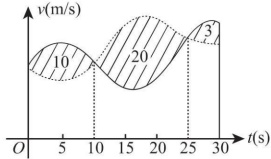

# 2017 年全国硕士研究生招生考试数学二真题

## 一、选择题

<!-- source: 【横版】10-26年数二真题套卷做题本.pdf; PDF 第 162 页 -->

### 第 1 题

若函数  $f(x)=\begin{cases}\frac{1-\cos\sqrt{x}}{ax},&x>0,\\b,&x\leq0\end{cases}$，在 x=0 处连续，则（）

A. $ab=\frac{1}{2}$.

B. $ab=-\frac{1}{2}$.

C. ab=0.

D. ab=2.

<!-- source: 【横版】10-26年数二真题套卷做题本.pdf; PDF 第 163 页 -->

### 第 2 题

设二阶可导函数  $f(x)$ 满足  $f(1) = f(-1) = 1$,  $f(0) = -1$ 且  $f''(x) > 0$, 则 ( )

A. $\int_{-1}^{1} f(x) \, dx > 0.$

B. $\int_{-1}^{1} f(x) \, dx < 0.$

C. $\int_{-1}^{0} f(x) \, dx > \int_{0}^{1} f(x) \, dx.$

D. $\int_{-1}^{0} f(x) \, dx < \int_{0}^{1} f(x) \, dx.$

<!-- source: 【横版】10-26年数二真题套卷做题本.pdf; PDF 第 164 页 -->

### 第 3 题

设数列  $\{x_n\}$ 收敛，则（）

A. 当  $\lim_{n\to\infty}\sin x_n=0$ 时， $\lim_{n\to\infty}x_n=0$.

B. 当  $\lim_{n\to\infty}(x_n+\sqrt{|x_n|})=0$ 时， $\lim_{n\to\infty}x_n=0$.

C. 当  $\lim_{n\to\infty}(x_n+x_n^2)=0$ 时， $\lim_{n\to\infty}x_n=0$.

D. 当  $\lim_{n\to\infty}(x_n+\sin x_n)=0$ 时， $\lim_{n\to\infty}x_n=0$.

<!-- source: 【横版】10-26年数二真题套卷做题本.pdf; PDF 第 165 页 -->

### 第 4 题

微分方程  $y'' - 4y' + 8y = e^{2x}(1 + \cos 2x)$ 的特解可设为  $y^* = (\quad)$

A. $Ae^{2x} + e^{2x}(B\cos 2x + C\sin 2x)$.

B. $Axe^{2x} + e^{2x}(B\cos 2x + C\sin 2x)$.

C. $Ae^{2x} + xe^{2x}(B\cos 2x + C\sin 2x)$.

D. $Axe^{2x} + xe^{2x}(B\cos 2x + C\sin 2x)$.

<!-- source: 【横版】10-26年数二真题套卷做题本.pdf; PDF 第 166 页 -->

### 第 5 题

设  $f(x,y)$ 具有一阶偏导数，且对任意的  $(x,y)$，都有  $\frac{\partial f(x,y)}{\partial x} > 0, \frac{\partial f(x,y)}{\partial y} < 0$，则 ( )

A. $f(0,0)>f(1,1).$

B. $f(0,0)<f(1,1).$

C. $f(0,1)>f(1,0).$

D. $f(0,1)<f(1,0).$

<!-- source: 【横版】10-26年数二真题套卷做题本.pdf; PDF 第 167 页 -->

### 第 6 题

甲,乙两人赛跑,计时开始时,甲在乙前方 10(单位:m)处,图中,实线表示甲的速度曲线  $v = v_1(t)$(单位:m/s), 虚线表示乙的速度曲线  $v = v_2(t)$, 三块阴影部分面积的数值依次为 10,20,3. 计时开始后乙追上甲的时刻记为  $t_0$(单位:s), 则 ( )

A. $t_0 = 10$.

B. $15 < t_0 < 20$.

C. $t_0 = 25$.

D. $t_0 > 25$.

<!-- source: 【横版】10-26年数二真题套卷做题本.pdf; PDF 第 168 页 -->

### 第 7 题

设 A 为 3 阶矩阵,  $P = (a_{1}, a_{2}, a_{3})$ 为可逆矩阵, 使得  $P^{-1} A P = \begin{pmatrix} 0 & 0 & 0 \\ 0 & 1 & 0 \\ 0 & 0 & 2 \end{pmatrix}$, 则  $A(a_{1} + a_{2} + a_{3}) = (\quad)$

A. $a_{1} + a_{2}$.

B. $a_{2} + 2a_{3}$.

C. $a_{2} + a_{3}$.

D. $a_{1} + 2a_{2}$.

<!-- source: 【横版】10-26年数二真题套卷做题本.pdf; PDF 第 169 页 -->

### 第 8 题

已知矩阵  $A = \begin{pmatrix} 2 & 0 & 0 \\ 0 & 2 & 1 \\ 0 & 0 & 1 \end{pmatrix}$,  $B = \begin{pmatrix} 2 & 1 & 0 \\ 0 & 2 & 0 \\ 0 & 0 & 1 \end{pmatrix}$,  $C = \begin{pmatrix} 1 & 0 & 0 \\ 0 & 2 & 0 \\ 0 & 0 & 2 \end{pmatrix}$，则（）

A. A 与 C 相似, B 与 C 相似.

B. A 与 C 相似, B 与 C 不相似.

C. A 与 C 不相似, B 与 C 相似.

D. A 与 C 不相似, B 与 C 不相似.

## 二、填空题

<!-- source: 【横版】10-26年数二真题套卷做题本.pdf; PDF 第 170 页 -->

### 第 9 题

曲线  $y = x(1 + \arcsin\frac{2}{x})$ 的斜渐近线方程为 ________.

<!-- source: 【横版】10-26年数二真题套卷做题本.pdf; PDF 第 171 页 -->

### 第 10 题

设函数  $y = y(x)$ 由参数方程  $\begin{cases} x = t + e^t, \\ y = \sin t \end{cases}$ 确定，则  $\left. \frac{d^2 y}{dx^2} \right|_{t=0} =$ ________.

<!-- source: 【横版】10-26年数二真题套卷做题本.pdf; PDF 第 172 页 -->

### 第 11 题

$\int_{0}^{+\infty}\frac{\ln(1+x)}{(1+x)^2}dx=$________.

<!-- source: 【横版】10-26年数二真题套卷做题本.pdf; PDF 第 173 页 -->

### 第 12 题

设函数  $f(x,y)$ 具有一阶连续偏导数，且  $df(x,y)=ye^y \mathrm{d}x + x(1+y)e^y \mathrm{d}y$,  $f(0,0)=0$，则  $f(x,y)=$ ________.

<!-- source: 【横版】10-26年数二真题套卷做题本.pdf; PDF 第 174 页 -->

### 第 13 题

$\int_{0}^{1}dy\int_{y}^{1}\frac{\tan x}{x}dx=$________.

<!-- source: 【横版】10-26年数二真题套卷做题本.pdf; PDF 第 175 页 -->

### 第 14 题

设矩阵  $A = \begin{pmatrix} 4 & 1 & -2 \\ 1 & 2 & a \\ 3 & 1 & -1 \end{pmatrix}$ 的一个特征向量为  $\begin{pmatrix} 1 \\ 1 \\ 2 \end{pmatrix}$，则 a = ________.

## 三、解答题

<!-- source: 【横版】10-26年数二真题套卷做题本.pdf; PDF 第 176 页 -->

### 第 15 题（10 分）

求 $\lim_{x\to0^{+}}\frac{\int_{0}^{x}\sqrt{x-t}e^{t}dt}{\sqrt{x^{3}}}$.

<!-- source: 【横版】10-26年数二真题套卷做题本.pdf; PDF 第 177 页 -->

### 第 16 题（10 分）

设函数 $f(u,v)$具有2阶连续偏导数， $y=f(e^x, \cos x)$，求 $\left.\frac{dy}{dx}\right|_{x=0}, \left.\frac{d^2y}{dx^2}\right|_{x=0}$.

<!-- source: 【横版】10-26年数二真题套卷做题本.pdf; PDF 第 178 页 -->

### 第 17 题（10 分）

求 $\lim_{n\to\infty}\sum_{k=1}^{n}\frac{k}{n^{2}}\ln\left(1+\frac{k}{n}\right)$

<!-- source: 【横版】10-26年数二真题套卷做题本.pdf; PDF 第 179 页 -->

### 第 18 题（10 分）

已知函数  $y(x)$ 由方程  $x^{3}+y^{3}-3x+3y-2=0$ 确定，求  $y(x)$ 的极值.

<!-- source: 【横版】10-26年数二真题套卷做题本.pdf; PDF 第 180 页 -->

### 第 19 题（10 分）

设函数  $f(x)$ 在区间  $[0,1]$ 上具有 2 阶导数，且  $f(1) > 0, \lim_{x \to 0^{+}} \frac{f(x)}{x} < 0$. 证明：

(I) 方程  $f(x)=0$ 在区间  $(0,1)$ 内至少存在一个实根；

(II) 方程  $f(x)f''(x) + [f'(x)]^{2} = 0$ 在区间  $(0,1)$ 内至少存在两个不同实根.

<!-- source: 【横版】10-26年数二真题套卷做题本.pdf; PDF 第 181 页 -->

### 第 20 题（11 分）

已知平面区域  $D=\left\{(x,y)\mid x^{2}+y^{2}\leqslant2y\right\}$，计算二重积分  $\iint_{D}(x+1)^{2}dxdy$.

<!-- source: 【横版】10-26年数二真题套卷做题本.pdf; PDF 第 182 页 -->

### 第 21 题（11 分）

设 $y(x)$是区间 $\left(0,\frac{3}{2}\right)$内的可导函数，且 $y(1)=0$。点P是曲线 $l:y=y(x)$上的任意一点，l在点P处的切线与y轴相交于点 $(0,Y_{P})$，法线与x轴相交于点 $(X_{P},0)$，若 $X_{P}=Y_{P}$，求l上点的坐标 $(x,y)$满足的方程。

<!-- source: 【横版】10-26年数二真题套卷做题本.pdf; PDF 第 183 页 -->

### 第 22 题（11 分）

设3阶矩阵 $A=(\alpha_{1},a_{2},a_{3})$有3个不同的特征值，且 $\alpha_{3}=\alpha_{1}+2\alpha_{2}$

(I) 证明  $r(A)=2;$

(II) 若  $\beta = \alpha_{1} + \alpha_{2} + \alpha_{3}$，求方程组 Ax =  $\beta$ 的通解.

<!-- source: 【横版】10-26年数二真题套卷做题本.pdf; PDF 第 184 页 -->

### 第 23 题（11 分）

设二次型  $f(x_{1},x_{2},x_{3})=2x_{1}^{2}-x_{2}^{2}+ax_{3}^{2}+2x_{1}x_{2}-8x_{1}x_{3}+2x_{2}x_{3}$ 在正交变换 x=Qy 下的标准形为  $\lambda_{1}y_{1}^{2}+\lambda_{2}y_{2}^{2}$，求 a 的值及一个正交矩阵 Q.
